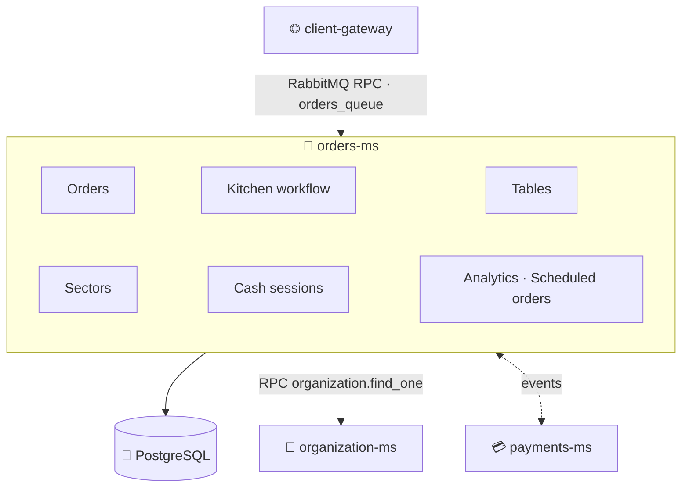
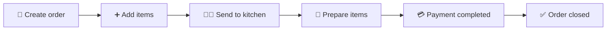
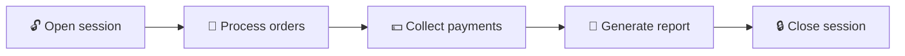
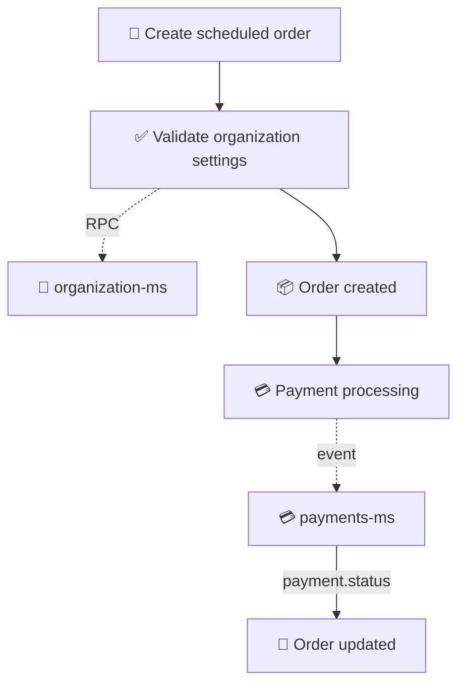

<h1 align="center">🧾 Orders Microservice · <code>orders-ms</code></h1>

<p align="center">
  <b>NestJS microservice</b> managing orders, tables, dining areas, cash sessions,<br/>
  kitchen workflows and sales analytics for a restaurant POS platform.<br/>
  <i>The operational core of the restaurant ecosystem.</i>
</p>

<p align="center">
  
  
  
  
  
</p>

<p align="center">
  
  
  
  
</p>

<br/>

## 🚀 Overview

`orders-ms` manages restaurant orders, POS orders, scheduled orders, order items, the kitchen workflow, tables, dining sectors, cash sessions, sales analytics and order scheduling — the entire operational flow from order creation to kitchen preparation and payment synchronization.

> [!IMPORTANT]
> The service communicates **exclusively through RabbitMQ** and acts as the operational core of the restaurant ecosystem. Every restaurant operation ultimately passes through `orders-ms`.

<br/>

## 🏗️ Architecture



<br/>

## ✨ Features

Dine-in orders · POS orders · scheduled orders · kitchen workflow management · table management · dining-area management · cash-session tracking · sales analytics · payment synchronization · multi-tenant architecture · order-scheduling validation.

<br/>

## 🛠️ Tech Stack

| Category | Technology |
|---|---|
| Framework | NestJS 11 |
| Language | TypeScript 5 |
| Database | PostgreSQL |
| ORM | TypeORM |
| Messaging | RabbitMQ |
| Cache | Redis |
| Validation | class-validator |
| Environment validation | Zod |
| Testing | Jest |
| Integration testing | Testcontainers |

<br/>

## ⚙️ Getting Started

**Prerequisites:** Node.js 20+, PostgreSQL, RabbitMQ, Docker (for integration tests).

```bash
npm install
cp .env.example .env
npm run start:dev
```

<details>
<summary><b>📜 Available scripts</b></summary>

<br/>

```bash
npm run build
npm run start        # start / start:dev / start:debug / start:prod
npm run lint
npm run format
npm run test         # test / test:watch / test:cov
npm run test:integration
npm run test:e2e
```

</details>

<br/>

## 🌍 Environment Variables

| Variable | Required | Description |
|---|:---:|---|
| `NODE_ENV` | ✅ | Environment |
| `PORT` | ❌ | Application port |
| `DB_HOST` | ✅ | PostgreSQL host |
| `DB_PORT` | ❌ | PostgreSQL port |
| `POSTGRES_USER` | ✅ | Database user |
| `POSTGRES_PASSWORD` | ✅ | Database password |
| `POSTGRES_DB` | ✅ | Database name |
| `RABBITMQ_URL` | ✅ | RabbitMQ connection |
| `RABBITMQ_QUEUE` | ✅ | Main RPC queue |
| `RMQ_EVENTS_QUEUE_ORDERS` | ✅ | Orders events queue |
| `RMQ_EVENTS_QUEUE_PAYMENTS` | ✅ | Payments events queue |
| `REDIS_HOST` | ✅ | Redis host |
| `REDIS_PORT` | ❌ | Redis port |
| `REDIS_PASS` | ✅ | Redis password |

<br/>

## 📨 RabbitMQ Patterns

Consumed and published events at a glance:

| Direction | Events |
|---|---|
| 📥 **Consumed** | `payment.status` · `customer.anonymized` |
| 📤 **Published** | `order.cancelled` |

<details>
<summary><b>🧾 Orders patterns</b></summary>

<br/>

`order.create` · `order.create_pos` · `order.find_all` · `order.find_one` · `order.update` · `order.add_item` · `order.remove_item` · `order.update_item` · `order.available_slots` · `order.send_to_kitchen` · `order.mark_item_prepared`

</details>

<details>
<summary><b>🪑 Tables patterns</b></summary>

<br/>

`table.create` · `table.find_all` · `table.find_one` · `table.update` · `table.soft_delete` · `table.update_positions` · `table.restore`

</details>

<details>
<summary><b>🗺️ Sectors patterns</b></summary>

<br/>

`sector.create` · `sector.find_all` · `sector.find_one` · `sector.update` · `sector.soft_delete` · `sector.restore`

</details>

<details>
<summary><b>💰 Cash Sessions patterns</b></summary>

<br/>

`cash_session.open` · `cash_session.close` · `cash_session.current` · `cash_session.find_one` · `cash_session.find_all` · `cash_session.report`

</details>

<details>
<summary><b>📊 Analytics patterns</b></summary>

<br/>

`analytics.orders.overview` · `analytics.orders.sales_by_type` · `analytics.orders.top_products` · `analytics.orders.category_breakdown`

</details>

<br/>

## 🍽️ Order Lifecycle



<details>
<summary><b>🍕 Order types</b></summary>

<br/>

- **Dine-In** — orders linked to restaurant tables (e.g. Table 12: Pizza Margherita, Coca-Cola, Tiramisu).
- **POS** — walk-in / takeaway orders created directly from the POS (e.g. Counter Order: Burger, Fries, Soft Drink).
- **Scheduled** — orders planned for a future date/time. The service validates opening hours, available time slots, maximum dishes per slot and scheduling intervals; organization settings are retrieved from `organization-ms`.

</details>

<details>
<summary><b>👨‍🍳 Kitchen workflow</b></summary>

<br/>

`Order created → Send to kitchen → Item preparation → Item ready → Order completed`

Supported actions: send order to kitchen · mark items as prepared · track preparation progress.

</details>

<br/>

## 🪑 Restaurant Management

<details>
<summary><b>Tables</b> — physical restaurant tables (Table 1, Table 15, Terrace A3…)</summary>

<br/>

Create · update · restore · reposition on floor plans · soft delete.

</details>

<details>
<summary><b>Sectors</b> — dining areas (Main Room, Terrace, VIP Area, Bar…)</summary>

<br/>

Create · update · restore · soft delete.

</details>

<br/>

## 💰 Cash Sessions

Cash sessions track cashier activity through the lifecycle:



Features: open session · close session · current session lookup · historical reports · session reporting.

<br/>

## 📊 Analytics

<details>
<summary><b>Available reports</b></summary>

<br/>

- **Orders Overview** — total orders, revenue, average ticket, order trends.
- **Sales By Type** — breakdown across Dine-In, POS, Scheduled Orders.
- **Top Products** — best-selling products, quantity sold, revenue generated.
- **Category Breakdown** — sales per category, revenue per category, product distribution.

</details>

<br/>

## 🗄️ Database Entities

<details>
<summary><b>View all entities</b></summary>

<br/>

| Entity | Purpose | Main fields |
|---|---|---|
| **Order** | A customer order | `organizationId`, `customerName`, `status`, `type`, `total`, `scheduledAt` |
| **OrderItem** | A product inside an order | `orderId`, `productId`, `quantity`, `unitPrice` |
| **OrderItemExtra** | Selected extras (Extra Cheese, Burrata, Bacon…) | — |
| **OrderItemRemovedIngredient** | Removed ingredients (No Onion, No Tomato…) | — |
| **OrderSlot** | Available scheduling windows (future orders, delivery/pickup slots) | — |
| **Table** | A restaurant table | `organizationId`, `sectorId`, `name`, `position` |
| **Sector** | A dining area | `organizationId`, `name` |
| **CashSession** | A cashier work session | `organizationId`, `openedAt`, `closedAt`, `openingAmount`, `closingAmount` |

</details>

<br/>

## 🔗 External Dependencies

| Dependency | Usage |
|---|---|
| 🐘 **PostgreSQL** | Stores orders, order items, tables, sectors, cash sessions |
| 🐇 **RabbitMQ** | RPC + event-driven communication, payment synchronization |
| 💳 **payments-ms** | Consumes `payment.status`; publishes `order.cancelled` |
| 🏢 **organization-ms** | Scheduling validation — opening hours, intervals, slot capacity, restaurant config |
| 🔐 **auth-ms** | Consumes `customer.anonymized` to remove customer-identifiable info from historical orders |

### Service integration flow



<br/>

## 🧪 Testing

| Type | Command | Uses |
|---|---|---|
| Unit | `npm run test` | Jest · ts-jest |
| Integration | `npm run test:integration` | Testcontainers · PostgreSQL containers (Docker required) |

<br/>

## ⚠️ Development Notes / Limitations

> [!WARNING]
> Tracked openly and worth verifying before production.

- **Unimplemented pattern:** the constant `order.cancel` exists but currently has no handler.
- **Env example:** `.env.example` is missing `RMQ_EVENTS_QUEUE_PAYMENTS` and `REDIS_PASS`, both required by startup validation.
- **Redis:** infrastructure is configured and initialized, but no active usage was found in the current codebase.
- **Duplicate definitions:** `TABLE_PATTERNS` and `Table` entities are duplicated under different modules.
- **E2E testing:** `npm run test:e2e` exists but references a configuration file not currently present in the repository.
- **Database migrations:** none found — dev relies on `synchronize: true`; the production migration strategy should be documented separately.

<br/>

## 📈 Service Scope

`orders-ms` is the operational heart of the restaurant platform — order management, kitchen workflow, table management, dining areas, cash sessions, scheduling, analytics and payment synchronization. Every restaurant operation ultimately passes through it.

<p align="center">
  
</p>